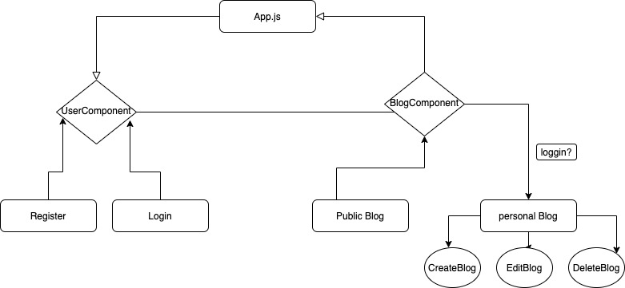
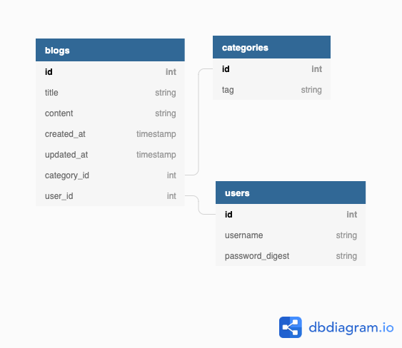

# ArchiveMyDay
> This blogger is like a daily diary where we can put down thoughts, experience, feelings, and anything that we wish to archive for a day

Deployed on: https://archive-my-day.herokuapp.com/

## Table of contents
* [General info](#general-info)
* [Demo](#demo)
* [Wireframes](#wireframes)
* [Database Model Associations](#database-model-associations)
* [Technologies](#technologies)
* [Prerequisite](#prerequisite)
* [Features](#features)
* [Status](#status)
* [Contact](#contact)

## General info
The purpose of this blogger is to create a place where people can use it to share love, thoughts, experience, and anything that makes a day.
I created this website mainly because I found even a few single words would make me feel relax and calm after a whole day busying working or studying.
With this easy and clean tool, we could record what we have seen and heard in our own way.

## Demo

### live example

### Screenshots

## Wireframes

  

## Database Model Associations

  

## Technologies
* Tech 1 - React version 17.0.2
* Tech 2 - Ruby version 2.6.6
* Tech 3 - Rails version 6.1.3
* Tech 4 - JWT token
* Tech 5 - Postgresql
* Tech 6 - material-ui/bootstrap/TinyMCE

## Prerequisite 
* install react :
`$npx create-react-app my-app`
`$cd my-app`
`$npm start`
* install Ruby by Homebrew:
`$ brew install rbenv ruby-build`
* install rails on Mac:
`$sudo gem install rails`
* install Postgresql: https://www.postgresql.org/download/

## Features
List of features ready:
* Awesome feature 1: implement JWT to verify the authenticity 
* Awesome feature 2: incorporate rich text editor to optimise the user experience
* Awesome feature 3: responsive website with images refreshed automatically

To-do list:
* improvement to be done 1: to add div collapse and extend
* improvement to be done 2: to add the search function 

## Status
Project is: _in progress_, I wish to continue optimising this site while writing my blogs 

## Contact
Created by [@Chelsie Fu](https://www.linkedin.com/in/chelsie-fu/) - feel free to contact me!
  